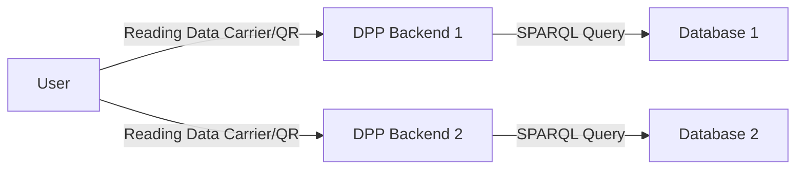

# DPP Backend

This repository contains a working version of code to package and present all available information regarding a product resolved using an identifier either represented using a DID or other means. A Data Carrier should represent some means to resolve to interactions (privileged or otherwise) to this backend, which then queries the available semantic/graph available at the backend to provide an appropriate response.

The flow is represented as follows:



It is assumed that the action of parsing the Data Carrier resolves to a combination of multiple data repositories which may combine to provide a holistic view of the history of the product.

## Required functionalities

1. Data Store: a database connection to GraphDB that checks connection regularly.

2. API endpoints:
    - DPP template CRUD with reference_uuid: publish a DPP template for the purpose of issuing DPPs, manage and update - additionally define the data model for the template as to how it receives the information.
    - DPP CRUD with reference to a template: Perfect happy flow requires that a request is made to issue a DPP. This may be done with an existing DPP UUID (a device that has updates from other locations), or with no DPP UUID, which autogenerates a locally controlled DID ID (controlled by a wallet), and associates provided data in the format that the template needs. An in-memory wallet implementation might be considered for brevity, but probably isn't required. Batch creation of DPPs is probably a good feature to have.
    - Credentials will have been accepted independently by the current holder of the DPP. If such credentials are pertained to refer to the DPP, then an API call to attach the credential with the DPP must be supported. Batch attaching of such credentials would be good. Ideally, endpoints to store a credential after issuance would make the situation easier, as such credentials could be referred to internally by UUID, and internally attached/registered.

3. ID resolution:
    At this moment, the happy flow is that an economic operator supports updates to the DID document to append further economic operators with additional information. Therefore, if a product comes in with a DID, an attempt must be made to append to the original economic operator of the DID (which also has made efforts to add content to itself).

    4 scenarios are possible when the following flow is to be supported:

    ```mermaid
    flowchart LR
        A[Manufacturer] --> H[DPP ID]
        A[Manufacturer] --> B[End user]
        A[Manufacturer] --> I[DPP Data Repository]
        B --> C[End user]
        C --> D[Remanufacturer]
        D --> J[DPP ID]
        D --> K[DPP Data Repository]
    ```

    We should start with the simple situation:

    ```mermaid
    flowchart LR
        A[Supplier] --> H[DPP ID]
        A --> D[Manufacturer]
        A --> I[DPP Data Repository]
        D --> K[DPP Data Repository]
    ```

    In this situation, the participants in the supply chain can contribute to the traceability and provenance, by also supporting a transfer (change) of controller status (a DID for the target organization) in the DID of the product passport.

    However, in the case that the upstream is not supporting a change, using the existing DID might resolve to the original entity, thus leaving out the upstream history of the product, therefore the following options are possible:
        - a trusted third party DPP ID registry managed by a consortium or shared interest group, which supports a sub-resolution to various product passport data repositories - potentially a DID:dpp method.
        - a new DID generated by the Data Repository, which might store information regarding the previous DID.

    In the more complex situation with a loss of observability in between (privacy considerations), as far as the Manufacturer is concerned, the product itself was sold, and the DPP is in a state of tentative transference. This is unlike a situation wherein the manufacturer directly makes that change. Thus, a remanufacturer might request a proof of sale from the end-user to be able to request access to appending events to the same DID, but without being mandatory.
    It's probably better to use a new one while referencing the old one though.

    Some events from the end-user might become observable - such as when the end-user registers some user-data online for access to online services, or associates a warranty document credential with the passport. Such events involve the last-known economic operator of the DID, and must be supported/recorded/observable.

    A scenario regarding DPP DID recovery is also needed, in order to identify the last known controller.

    Event CRUD is a good part of the API to have, to make it simpler to add signed events to a DPP. Batch events relevant to multiple DPPs are an important aspect to support.

    When a new entity requests a controller relationship over the product, in order to, it becomes a bit of a difficult issue unless proof of the chain of provenance is demonstrated.

## Perspectives

User to DPP Backend

- Event Templates and interactions
- Model Templates and instantiations
- Access Control Map Data Model Templates and instantiations (Recommended and customizations)
  - Requestee-scope and Requestor-role-based access control on attributes and maps.
- Customized presentation

DPP Backend to Wallet API, Issuer API
User to Wallet API

- Register/login on start-up
- Generate DIDs for products, resolve for external entities, update controller.
- Create events. Generate signature of event, sign and add to data store.
- Receive credentials from third-parties.
  - Supporting an receiver-initiated or issuer-initiated credential issuance.