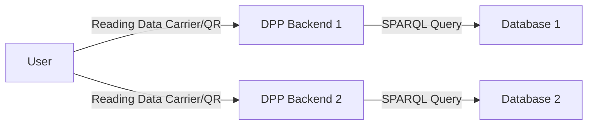

# DPP Backend

This repository contains a working version of code to package and present all available information regarding a product resolved using an identifier either represented using a DID or other means. A Data Carrier should represent some means to resolve to interactions (privileged or otherwise) to this backend, which then queries the available semantic/graph available at the backend to provide an appropriate response.

The flow is represented as follows:



It is assumed that the action of parsing the Data Carrier resolves to a combination of multiple data repositories which may combine to provide a holistic view of the history of the product.

## Required functionalities

1. Data Store: a database connection to GraphDB that checks connection regularly.

2. API endpoints:
    - DPP template CRUD with reference_uuid: publish a DPP template for the purpose of issuing DPPs, manage and update - additionally define the data model for the template as to how it receives the information.
    - DPP CRUD with reference to a template: Perfect happy flow requires that a request is made to issue a DPP. This may be done with an existing DPP UUID (a device that has updates from other locations), or with no DPP UUID, which autogenerates a locally controlled DID ID (controlled by a wallet), and associates provided data in the format that the template needs. An in-memory wallet implementation might be considered for brevity, but probably isn't required. Batch creation of DPPs is probably a good feature to have.
    - Credentials will have been accepted independently by the current holder of the DPP. If such credentials are pertained to refer to the DPP, then an API call to attach the credential with the DPP must be supported. Batch attaching of such credentials would be good. Ideally, endpoints to store a credential after issuance would make the situation easier, as such credentials could be referred to internally by UUID, and internally attached/registered.

3. ID resolution:
    At this moment, the happy flow is that an economic operator supports updates to the DID document to append further economic operators with additional information. Therefore, if a product comes in with a DID, an attempt must be made to append to the original economic operator of the DID (which also has made efforts to add content to itself).

    4 scenarios are possible when the following flow is to be supported:

    ```mermaid
    flowchart LR
        A[Manufacturer] --> H[DPP ID]
        A[Manufacturer] --> B[End user]
        A[Manufacturer] --> I[DPP Data Repository]
        B --> C[End user]
        C --> D[Remanufacturer]
        D --> J[DPP ID]
        D --> K[DPP Data Repository]
    ```

    We should start with the simple situation:

    ```mermaid
    flowchart LR
        A[Supplier] --> H[DPP ID]
        A --> D[Manufacturer]
        A --> I[DPP Data Repository]
        D --> K[DPP Data Repository]
    ```

    In this situation, the participants in the supply chain can contribute to the traceability and provenance, by also supporting a transfer (change) of controller status (a DID for the target organization) in the DID of the product passport.

    However, in the case that the upstream is not supporting a change, using the existing DID might resolve to the original entity, thus leaving out the upstream history of the product, therefore the following options are possible:
        - a trusted third party DPP ID registry managed by a consortium or shared interest group, which supports a sub-resolution to various product passport data repositories - potentially a DID:dpp method.
        - a new DID generated by the Data Repository, which might store information regarding the previous DID.

    In the more complex situation with a loss of observability in between (privacy considerations), as far as the Manufacturer is concerned, the product itself was sold, and the DPP is in a state of tentative transference. This is unlike a situation wherein the manufacturer directly makes that change. Thus, a remanufacturer might request a proof of sale from the end-user to be able to request access to appending events to the same DID, but without being mandatory.
    It's probably better to use a new one while referencing the old one though.

    Some events from the end-user might become observable - such as when the end-user registers some user-data online for access to online services, or associates a warranty document credential with the passport. Such events involve the last-known economic operator of the DID, and must be supported/recorded/observable.

    A scenario regarding DPP DID recovery is also needed, in order to identify the last known controller.

    Event CRUD is a good part of the API to have, to make it simpler to add signed events to a DPP. Batch events relevant to multiple DPPs are an important aspect to support.

    When a new entity requests a controller relationship over the product, in order to, it becomes a bit of a difficult issue unless proof of the chain of provenance is demonstrated.

## Perspectives

User to DPP Backend

- Event Templates and interactions
- Model Templates and instantiations
- Access Control Map Data Model Templates and instantiations (Recommended and customizations)
  - Requestee-scope and Requestor-role-based access control on attributes and maps.
- Customized presentation

DPP Backend to Wallet API, Issuer API
User to Wallet API

- Register/login on start-up
- Generate DIDs for products, resolve for external entities, update controller.
- Create events. Generate signature of event, sign and add to data store.
- Receive credentials from third-parties.
  - Supporting an receiver-initiated or issuer-initiated credential issuance.

## Initial version of API endpoints

DPP-Templates

1. POST /dpp-templates/ with body containing JSON-schema of attributes at least, but also events, credentials, other basic aspects - creates a partial or empty shell, returns UUID/idShort
    - Must contain seeding option to pre-add basic information to repository.
    - Should contain duplicating and reversioning capabilities, typically from the side of the UI.
2. POST /dpp-templates/{uuid}/attributes - Add attributes to the attribute data model that weren't added before
3. POST /dpp-templates/{uuid}/events - Add event models to the event data model that weren't added before.
4. POST /dpp-templates/{uuid}/credentials - Add credential models to the template that are supported to be added to the content. These need not be directly represented, and could also be URL references to credential-schemas stored in a wallet.
5. POST /dpp-templates/{uuid}/attachments - Attach files, such as images or PDFs to the DPP that can returned in a URL or embedded form when the DPP is requested in a complete form.
6. POST /dpp-templates/{uuid}/publish/{version} - Lock a certain format with current format.
7. CRUD for the above, to update and delete versions, not templates. A UUID is merely versioned with tags.
8. Future work on ACLs- POST /dpp-templates/{uuid}/acls - this depends on where specifically we integrate the Access Control aspects. At the database level, it allows us to register a role as a user and limit queries at the data-querying level.
At the template level, we'd have to specify it a bit more at the level that we get all the data, and create a subset. This is good enough as a hack.

Make tags "latest" and "version_number" for a template.
This shall be available henceforth as /dpp-templates/{id_short}?version=version_number with all the content.
Also as /dpp-templates/{id_short} if version is latest.
 It's possible to delete the versions.

DPPs

1. POST /dpps/{template_id_short}?version=latest/version_number - create a DPP with basic attributes (body contains attributes with optional or non-optional content)
2. POST /dpp-templates/{id_short}/create?version=version_number - same as above, alternative endpoint, since it's a non-standard choice
3. GET /dpps/{uuid} - basic compact pull with no signature.
4. GET /dpps/{uuid}/self-signed - basic compact pull with self-signature
5. GET /dpps/{uuid}/signed - compact pull with embedded signatures from wallet in response to a challenge nonce
6. GET /dpps/{uuid}/full - pull dpp with all attachment links and images attached. (no signature, it's a bigger pull)
7. GET /dpps/latest - UI-specific - get the last DPP that was generated
8. GET /dpps/random - UI-specific - get a random DPP based on available IDs in the graph_db. These IDs is preferably cached at the backend.
9. POST /dpps/{uuid}/events - Add event of type that matches the registered types in the registered version.
    - Perhaps also POST /dpps/{uuid}/events/activity and POST /dpps/{uuid}/events/ownership
10. POST /dpps/{uuid}/attachments - Add a file that is stored with a reference to it added to the DPP itself.
11. GET /dpps/{uuid}/events/activity and GET /ddps/{uuid}/events/ownership - to get just the subsets of data about the DPP. Specifically for the UI, since it might be easier to get a modular amount of data.

Other endpoints

1. GET /credentials/available - (Find credentials available for use at the SSI wallet. Future work may support creating format for figuring out how to create a on-demand policy for association with a class of product and period of time, corresponding to the validity of the credential.)

### Future

#### ID-resolution discussion

- DID-based ProductPassport service resolution (Currently we try URN-based without signatures, then we add some DID-based signature validation, initially did:web-first. Then we add external signatures, selective disclosure and identity-based access control.)

Due to the URN-based nature of DPPs, we assume that we must independently provide the link to the original source of information each time. For instance, <urn:solarframeworks:product:111> needs to find (with independent configuration about the location of the DPP passport, the data at this address) <http://dpp-data.solarframeworks.com/dpps/urn:solarframeworks:product:111>.

A web-based approach can also be supported, if defined well. For instance, like with HATEOAS, the products are automatically named <http://dpp-data.solarframeworks.com/dpps/urn:solarframeworks:product:111>. The name is the URL. This is also doable, but depends on the company existing, and holding all the cards for ID resolution, not easily scalable or divestable.

A DID-based approach solves this, because then, a company can support something like <did:solarframeworks:dpp-data:product:111> which supports the concept of a controller of a decentralized identifier - implying that the location of the ID resolution could be placed in a industry-supporting registry, managed by the EU, or other organizations, with a strategy towards updating the controller of a DID document.

This will be expanded upon in a different document. Other strategies for globally unique IDs exist as well, and all have some tradeoffs and advantages.

TODO: Figure out GeneratedBy, EventDeltas, and the integration of InstantaneousEvents vs Activities in Prov-O.

i.e. something like this to be added to the base ontology as a custom type of annotation that may be supported by specific events that want to describe deltas. Would enable attribute history for infrequent changes, but is infeasible for broader changes.

```turtle
ex:Change a prov:Activity ;
    prov:wasAssociatedWith ex:ChangeEvent ;
    prov:used ex:Attribute ;
    prov:hadValueBefore "oldValue" ;
    prov:hadValueAfter "newValue" .
```
