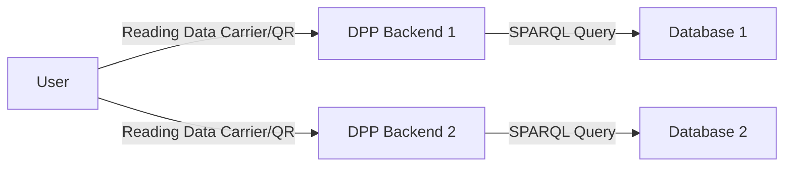

# DPP Backend

This repository contains a working version of code to package and present all available information regarding a product resolved using an identifier either represented using a DID or other means. A Data Carrier should represent some means to resolve to interactions (privileged or otherwise) to this backend, which then queries the available semantic/graph available at the backend to provide an appropriate response.

The flow is represented as follows:

It is assumed that the action of parsing the Data Carrier resolves to a combination of multiple data repositories which may combine to provide a holistic view of the history of the product.
