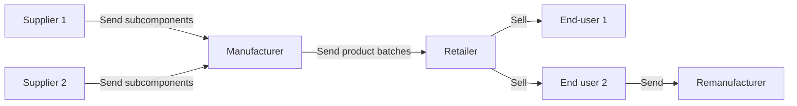
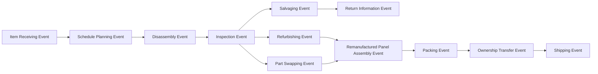

# Ontology development

For the moment, the initial unrefined/unversioned versions of ontologies used for the reference implementation are stored here.
At a later moment, these shall be formalized and integrated better into the DPP application, preferably externally stored.

In addition, certain external ontologies are also included for the purpose of reference, for providing input towards events that might be part of a DPP passport.

- GS1 EPCIS 2.0 - <https://ref.gs1.org/standards/epcis/artefacts> - Eventual interoperability with such a standard is necessary.
In addition, the [UNTP](https://uncefact.github.io/spec-untp/docs/specification/TraceabilityEvents/) also has a reference to this [here](https://jargon.sh/user/unece/traceabilityEvents/v/working/artefacts/readme/render)
- PROV-O - Basic ontology supporting Provenance tracking, as a starting point.
- FeDERATED - Provenance tracking in Logistics, though generalizable. Not initially included, but in plans.

An interesting reference for us to reference/consider, by the Pathfinder Provenance Framework is available [here](https://wbcsd.github.io/data-exchange-protocol/v2/)

## Actual ontology

For the purpose of the demo, we already have an idea of the supply chain.

In this example, our companies are named the following:

- Supplier 1: SunSparkle Photons Inc. - Photovoltaic Cells
- Supplier 2: SolarEclipse Panels Ltd. - Solar Panel Frames
- Manufacturer: PhotonForge SolarWorks - Solar Panels Manufacturing and Assembly
- Retailer: LuminousOddity Solar Emporium - Retail sales for solar panels
- Remanufacturer: RenewCycle SolarTech GmbH - Remanufacturing facility for old/faulty Solar Panels with observability.

### Event sequences

The optimal-flow sequences are as follows:

#### Photovoltaic Cells Supplier

#### Frame Supplier

#### Panel Manufacturer

#### Retailer

#### Remanufacturer

Each of these entities have their own data models for the products that are the core aspect of their business.

To support a Provenance Tracking solution, a modification is thus made to adapt their internal data into a message model form based on DPP core ontologies/concepts to make it interoperable with the rest of the ecosystem. To be ideal, the scope of the core ontology must be minimal, as many context-specific standards (for instance, in batteries), as well as function-specific standards (for instance, in events, with GS1 EPCIS, FeDERATED) may come up. A generic non-normative event standard is available with PROV-O, so we use that as a starting point. However, we assume that application-profiles should be defined by each of the end-user organizations or interest groups, to enable true decentralization.

The ontologies in this folder represent an example of ontologies defined by each of these organizations in the supply chain in the previous paragraph, along with the core ontology, and an instance graph for demonstration of a comprehensive full-scale ontology.
